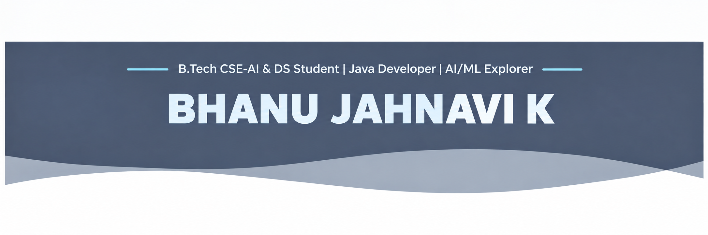

## Hi I'm Bhanu Jahnavi K 👋

  

  

# 💫 About Me:

I am a B.Tech student in Artificial Intelligence & Data Science, aspiring to build a career as a Machine Learning Engineer. I have a strong foundation in Python, Machine Learning, Deep Learning, and Data Science, with hands-on experience in developing, evaluating, and deploying AI-based solutions.

My project experience includes developing a CNN-based Plant Disease Detection system achieving over 92% accuracy, a real-time Computer Vision-based Online Exam Cheating Detection System, and a responsive web application for a real-world construction company.

My technical interests include Machine Learning, Deep Learning, Computer Vision, Data Science, and AI-driven application development. I work with technologies such as Python, Scikit-learn, TensorFlow, Keras, OpenCV, MediaPipe, Pandas, NumPy, Flask, and Streamlit.

I have also completed virtual internships in Machine Learning & Data Science and Java Full Stack Development, gaining practical exposure to model development, data preprocessing, predictive modeling, and software development practices.

Currently, I am focused on continuously improving my technical skills, building practical AI projects, and applying machine learning to solve real-world problems.
